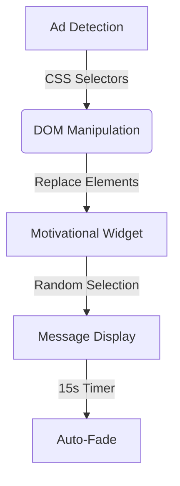

# AdFriend 🌟 - Transform Ads into Motivation!


[](https://opensource.org/licenses/MIT)
[](https://chrome.google.com/webstore)

Turn intrusive ads into daily inspiration! AdFriend is a Chrome extension that replaces advertisements with beautiful motivational messages, helping you stay focused and positive while browsing.

[AdFriend Presentation](https://gamma.app/docs/AdFriend-Motivate-Your-Browse-g9xqbfss2q8nsn4)

## ✨ Features That Spark Joy

- 🛡️ **Ad-Free Browsing**  
  Automatically detects and blocks ads using smart DOM analysis
- 💌 **Daily Inspiration**  
  20+ curated motivational messages that randomly appear
- 🎨 **Beautiful Design**  
  Gradient backgrounds with smooth animations
- ⏱️ **Smart Timing**  
  Messages auto-fade after 15 seconds
- 🎮 **Interactive Controls**  
  Manual close button for instant removal
- 🪶 **Lightweight**  
  Zero performance impact on browsing

## 🚀 Quick Start

### Installation Guide

1. **Clone Repository**  
   ```bash
   git clone https://github.com/your-repository/AdFriend.git
   ```

2. **Load in Chrome**:
   - Visit `chrome://extensions`
   - Enable **Developer Mode** (top-right toggle)
   - Click "Load Unpacked" and select project folder

3. **Start Inspiring!**  
   The extension activates automatically - browse normally and watch ads transform!

## 🛠️ How It Works

AdFriend uses a three-layer approach:



**Technical Highlights**:
- Chrome Extension Manifest V3
- DOM Content Script Injection
- CSS Animation Framework
- Service Worker Background Script

## 👩💻 Meet the Team

| Role                | Member                      | Contribution                          | Fun Fact 🎉                          |
|----------------------|-----------------------------|---------------------------------------|--------------------------------------|
| Project Lead         | Esra Mohammednour Mohammed  | Core Architecture & Logic             | Codes to lofi beats! 🎧             |
| Ad Detection Expert  | Akram Adam Hassan           | Selector Engine & DOM Manipulation    | Rubik's Cube champion 🎯            |
| UI/UX Designer       | Omer Abdulrahim Eltoum      | Visual Design & Animations            | Minimalism enthusiast 🖼️            |

## 🌟 Why AdFriend?

### The Problem
- 😫 Ads disrupt focus and productivity
- 😞 Negative content affects mood
- ⏳ Wasted time on irrelevant promotions

### Our Solution
- ✅ 1-click positivity boost
- ✅ Customizable experience (future update!)
- ✅ Open-source & privacy-focused

## 🧩 Challenges Overcome

| Challenge            | Solution                    |
|----------------------|-----------------------------|
| Dynamic Ad Detection | Hybrid CSS Selector System  |
| Smooth Transitions   | CSS Keyframe Animations     |
| Cross-Site Support   | Content Script Injection   |
| Performance          | Lightweight DOM Handling    |
| testing          | as we dont have ads in sudan it was hard to test     |

## 📈 Future Roadmap

- [ ] User Custom Message Library
- [ ] Productivity Timer Integration
- [ ] Firefox/Edge Support
- [ ] Chrome Web Store Deployment

## 🤝 Contribute & Connect

We welcome contributions! Please read our [Contribution Guidelines](CONTRIBUTING.md) before submitting PRs.

**Get in Touch** 📬  
- Email: [team@adfriend.dev](mailto:esraa2023112@gmail.com)
- Discord: [Join our Community](https://discord.gg/your-link)

---

Made with ❤️ by Team AdFriend - Transforming the web one ad at a **time**!
